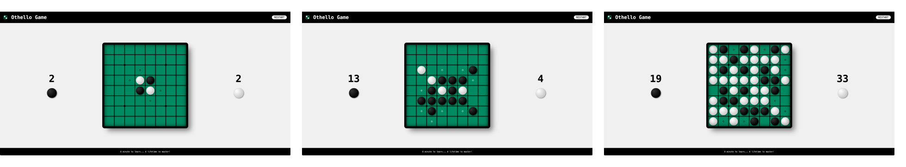

# Web - Othello Game

<details>
        <summary>
        CLICK TO ENLARGE 😇
        </summary>
        📄 <a href="#description">Description</a>
        <br>
        🎓 <a href="#objectives">Objectives</a>
        <br>
        🔨 <a href="#tech-stack">Tech stack</a>
        <br>
        📂 <a href="#files-description">Files description</a>
        <br>
        💻 <a href="#installation_and_how_to_use">Installation and how to use</a>
        <br>
        🔧 <a href="#whats-next">What's next ?</a>
        <br>
        ♥️ <a href="#thanks">Thanks</a>
        <br>
        👷 <a href="#authors">Authors</a>
</details>

## 📄 <span id="description">Description</span>

This project is a browser-based implementation of the classic Othello (also known as Reversi) board game. The game is designed using HTML5, CSS3, and JavaScript. Players take turns placing black or white pieces on the board, flipping the opponent's pieces by surrounding them in a straight line. The game continues until neither player can make a valid move, and the player with the most pieces on the board wins.

Please note that, for now, the game is only playable in a local two-player mode, where players take turns on the same device.

## 🎓 <span id="objectives">Objectives</span>

The primary goal of this project is to create a playable version of Othello with a functional UI and game logic. The focus is on:

- Implementing the core game mechanics (player turns, piece placement, and flipping).
- Rendering a dynamic game board with valid moves highlighted.
- Allowing users to restart the game, track scores, and determine the winner.
- Enhancing skills in HTML, CSS, and JavaScript while building a complete interactive game.


## 🔨 <span id="tech-stack">Tech stack</span>

<p align="left">
    
    
    
</p>

## 📂 <span id="files-description">File description</span>

| **FILE**          | **DESCRIPTION**                                               |
| :---------------: | ------------------------------------------------------------- |
| `resources`       | Contains the resources required for the repository.           |
| `README.md`       | The readme file you are currently reading 😉.                 |
| `behavior.js`     | JavaScript code for dynamic page interactions and animations. |
| `index.html`      | Main HTML file for the Othello Game.                          |
| `othello_game.js` | Contains the core game logic for the Othello Game.            |
| `styles.css`      | CSS stylesheet for the Othello Game layout.                   |

## 💻 <span id="installation_and_how_to_use">Installation and how to use</span>

**Installation:**

1. Clone this repository:
    - Open your preferred Terminal.
    - Navigate to the directory where you want to clone the repository.
    - Run the following command:

```
git clone https://github.com/fchavonet/web-othello_game.git
```

2. Open the repository you've just cloned.

3. Open the `index.html` file in a web browser to play the game.

**How to use:**

1. Once the page is open, the game board will be displayed with an initial setup of pieces.

2. Players take turns clicking on empty cells to place their pieces. Valid moves will be highlighted.

3. The score is automatically updated as pieces are placed.

4. Press the "Restart" button at the top-right to reset the game at any time.

You can also test the game online by clicking [here](https://fchavonet.github.io/web-othello_game/).

<p align="center">
    
</p>

## 🔧 <span id="whats-next">What's next ?</span>

- Create a game rules page.
- Add an "About" page with the history of Othello Game.
- Implement piece-flipping animations.
- Improve the overall user interface (UI).
- Add a login system.
- Create an online multiplayer mode.
- Implement a score tracking system with player login.
- Add the ability to save games.
- Enable replays of previous games.
- Introduce an AI opponent (with the help of <a href="https://github.com/Eonvorax">Eonvorax</a> specializing in machine learning).

## ♥️ <span id="thanks">Thanks</span>

- Thank all those who have participated in or helped to carry out the project.

## 👷 <span id="authors">Authors</span>

**Fabien CHAVONET**
- Github: [@fchavonet](https://github.com/fchavonet)
